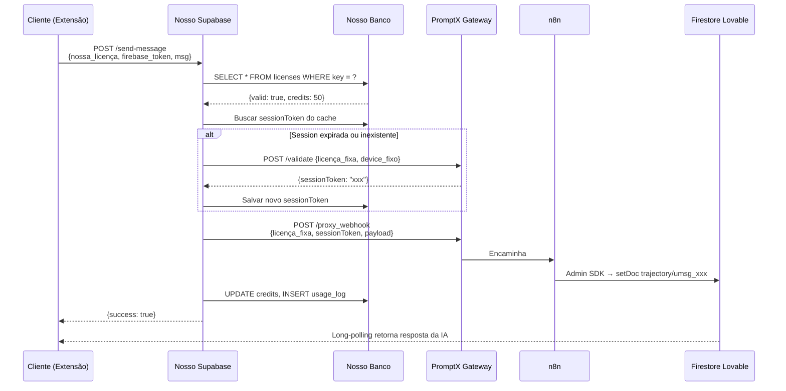

# 📋 PRD — Proxy Funil v1.0

## Product Requirements Document
> **Data:** 21/02/2026  
> **Versão:** 1.0  
> **Status:** Aguardando implementação

---

## 1. Visão Geral do Produto

### Problema
O Lovable cobra créditos (~0.35 a 1.0) por cada mensagem enviada. O PromptX v3.1 já resolve isso com um proxy que escreve direto no Firestore via Firebase Admin SDK, contornando o billing. Porém, o PromptX oferece esse serviço apenas para seus próprios clientes com licenças individuais.

### Solução
Criar um **proxy intermediário** (funil) que:
1. Gerencia licenças dos **nossos** clientes via **nosso** Supabase
2. Redireciona todas as requisições por **uma única licença PromptX** fixa
3. Para o PromptX, parece ser **um único usuário** legítimo
4. Para nossos clientes, é um serviço independente e transparente

### Resultado esperado
Nossos clientes enviam mensagens no Lovable sem gastar créditos, usando **nossa** extensão com **nossa** licença, sem saber que por trás existe o PromptX.

---

## 2. Arquitetura

### Diagrama de alto nível

```
┌─────────────────────────────────────────────────────────────────┐
│                        NOSSOS CLIENTES                          │
│  Cliente A       Cliente B       Cliente C       ...Cliente N   │
│  (extensão)      (extensão)      (extensão)      (extensão)    │
└───────┬──────────────┬──────────────┬──────────────────┬────────┘
        │              │              │                  │
        ▼              ▼              ▼                  ▼
┌─────────────────────────────────────────────────────────────────┐
│                      NOSSO SUPABASE                              │
│  Edge Function: send-message                                     │
│  ┌───────────────┐ ┌───────────────┐ ┌───────────────────────┐  │
│  │ Validar       │→│ Controlar     │→│ Encaminhar para       │  │
│  │ NOSSA licença │ │ cota/consumo  │ │ PromptX (1 licença)   │  │
│  └───────────────┘ └───────────────┘ └───────────┬───────────┘  │
│  Tabelas: licenses, usage_logs, session_cache     │              │
└───────────────────────────────────────────────────┼──────────────┘
                                                    │
        ┌ ─ ─ ─ ─ ─ ─ ─ ─ ─ ─ ─ ─ ─ ─ ─ ─ ─ ─ ─ ┤
        │   INVISÍVEL — PromptX vê 1 usuário        │
        ▼                                           │
┌───────────────────┐    ┌──────────┐    ┌──────────┴──────────┐
│ PromptX           │───→│ n8n      │───→│ Firestore Lovable    │
│ secure-gateway    │    │ webhook  │    │ trajectory/umsg_{id} │
└───────────────────┘    └──────────┘    └─────────────────────┘
```

### Fluxo de uma requisição



---

## 3. Componentes e Responsabilidades

### 3.1. Extensão do Cliente (Chrome Extension)

**O que faz:**
- Captura o Firebase ID Token do Lovable via `interceptor.js` (bypass webpack)
- Envia mensagens para **nosso** Supabase (nunca fala com PromptX)
- Exibe respostas da IA via long-polling (mecanismo nativo do Lovable)

**O que NÃO faz:**
- Não conhece o PromptX
- Não guarda licenças do PromptX
- Não faz cache de sessionToken

**Endpoint único:**
```
POST https://{NOSSO_SUPABASE}/functions/v1/send-message
```

**Payload enviado pela extensão:**
```json
{
  "licenseKey": "NOSSA-XXXX-XXXX-XXXX",
  "message": "Mude o fundo para azul",
  "projectId": "7b04c009-e736-4bf6-ba32-b150f7d2a2cc",
  "token": "<Firebase ID Token real do Lovable>",
  "files": []
}
```

**Headers:**
```
Content-Type: application/json
Authorization: Bearer {NOSSA_ANON_KEY}
```

---

### 3.2. Nosso Supabase — Edge Function `send-message`

**Responsabilidades:**

| # | Tarefa | Detalhe |
|---|---|---|
| 1 | Autenticar cliente | Validar licenseKey na tabela `licenses` |
| 2 | Verificar cota | Checar se `credits_remaining > 0` ou plano ilimitado |
| 3 | Obter sessão PromptX | Buscar `sessionToken` do cache ou criar nova |
| 4 | Montar payload | Injetar licença fixa + deviceId fixo + sessionToken |
| 5 | Encaminhar para PromptX | POST no secure-gateway com payload montado |
| 6 | Registrar uso | Decrementar créditos, inserir log |
| 7 | Retornar resultado | `{success, message}` para o cliente |
| 8 | Tratar erros | 401 → renova sessão e tenta de novo |

**Variáveis de ambiente (secrets do Supabase):**

| Variável | Valor | Descrição |
|---|---|---|
| `PROMPTX_LICENSE_KEY` | `TDH8-3XO7-P9MC-PY3Y` | Única licença PromptX 3.1 usada no funil (não geramos licenças no Supabase do PromptX) |
| `PROMPTX_DEVICE_ID` | `HWID_INTEL(R)CORE(TM)I5-10500H...` | DeviceId fixo |
| `PROMPTX_GATEWAY_URL` | `https://selnzytylaxenmqxsdkj.supabase.co/functions/v1/secure-gateway` | Endpoint do gateway |
| `PROMPTX_ANON_KEY` | `eyJhbGciOiJIUzI1NiIs...` | Anon key do Supabase PromptX |

> [!IMPORTANT]
> As credenciais do PromptX ficam SOMENTE como secrets no nosso Supabase. Nunca vão para o código do client. Nossos clientes não sabem que o PromptX existe.

**Pseudocódigo da Edge Function:**

```typescript
// 1. Validar NOSSA licença
const license = await supabase
  .from('licenses').select('*')
  .eq('key', body.licenseKey).single();
if (!license || !license.active) return error(401, 'Licença inválida');
if (license.credits_remaining <= 0) return error(403, 'Créditos esgotados');

// 2. Obter sessionToken do PromptX (com cache)
let session = await getOrCreatePromptxSession();

// 3. Encaminhar para PromptX
let result = await callPromptxGateway(session.token, {
  message: body.message,
  projectId: body.projectId,
  token: body.token,    // Firebase token do CLIENTE
  source: 'RESELLER-EXT',
  files: body.files || []
});

// 4. Se sessão expirou, renovar e tentar de novo
if (result.status === 401) {
  session = await createNewPromptxSession();
  result = await callPromptxGateway(session.token, payload);
}

// 5. Registrar uso
await supabase.from('usage_logs').insert({...});
await supabase.from('licenses')
  .update({ credits_remaining: license.credits_remaining - 1 })
  .eq('id', license.id);

// 6. Retornar
return { success: true, message: 'Mensagem enviada' };
```

---

### 3.3. Nosso Supabase — Banco de Dados

#### Tabela `licenses`

```sql
CREATE TABLE licenses (
  id UUID PRIMARY KEY DEFAULT gen_random_uuid(),
  key TEXT UNIQUE NOT NULL,          -- 'NOSSA-XXXX-XXXX-XXXX'
  user_email TEXT,                   -- email do cliente
  plan TEXT DEFAULT 'basic',         -- 'basic', 'pro', 'unlimited'
  credits_remaining INT DEFAULT 100, -- créditos restantes
  credits_total INT DEFAULT 100,     -- créditos totais do plano
  active BOOLEAN DEFAULT true,
  expires_at TIMESTAMPTZ,
  created_at TIMESTAMPTZ DEFAULT now(),
  updated_at TIMESTAMPTZ DEFAULT now()
);
```

#### Tabela `usage_logs`

```sql
CREATE TABLE usage_logs (
  id UUID PRIMARY KEY DEFAULT gen_random_uuid(),
  license_id UUID REFERENCES licenses(id),
  project_id TEXT NOT NULL,          -- projectId do Lovable
  action TEXT DEFAULT 'send_message',
  credits_used INT DEFAULT 1,
  timestamp TIMESTAMPTZ DEFAULT now()
);
```

#### Tabela `session_cache`

```sql
CREATE TABLE session_cache (
  id UUID PRIMARY KEY DEFAULT gen_random_uuid(),
  promptx_session_token TEXT NOT NULL,
  promptx_license_key TEXT NOT NULL,
  created_at TIMESTAMPTZ DEFAULT now(),
  expires_at TIMESTAMPTZ NOT NULL    -- created_at + 50min
);
```

#### Row Level Security (RLS)

```sql
-- Somente a Edge Function (service_role) acessa as tabelas
ALTER TABLE licenses ENABLE ROW LEVEL SECURITY;
ALTER TABLE usage_logs ENABLE ROW LEVEL SECURITY;
ALTER TABLE session_cache ENABLE ROW LEVEL SECURITY;

-- Nenhuma policy para anon = ninguém de fora acessa diretamente
-- A Edge Function usa service_role_key internamente
```

---

## 4. Anti-Detecção

### Regras de camuflagem

| Regra | Implementação |
|---|---|
| **1 deviceId sempre** | Variável de ambiente `PROMPTX_DEVICE_ID` — nunca muda |
| **1 licença sempre** | Variável de ambiente `PROMPTX_LICENSE_KEY` — nunca muda |
| **Session reuse** | Cache de sessionToken por 50min, renova antes de expirar |
| **Rate limit global** | Máximo 3 req/segundo para o PromptX (fila interna) |
| **Delay entre requisições** | Mínimo 2s entre chamadas ao secure-gateway |
| **Sem paralelismo** | Requisições ao PromptX são sequenciais (mutex/fila) |

### Implementação da fila

```typescript
// Fila simples com delay — garante que o PromptX vê uso "humano"
const QUEUE: Array<() => Promise<void>> = [];
let processing = false;

async function enqueue(fn: () => Promise<any>) {
  return new Promise((resolve, reject) => {
    QUEUE.push(async () => {
      try { resolve(await fn()); }
      catch (e) { reject(e); }
    });
    if (!processing) processQueue();
  });
}

async function processQueue() {
  processing = true;
  while (QUEUE.length > 0) {
    const job = QUEUE.shift()!;
    await job();
    await delay(2000 + Math.random() * 3000); // 2-5s entre cada
  }
  processing = false;
}
```

> [!NOTE]
> Como Edge Functions são stateless, a fila precisa ser coordenada via banco (ex: tabela `request_queue` com lock) ou usar um approach de "lease" com timestamps. Detalhar na implementação.

---

## 5. Tratamento de Erros

| Cenário | Detecção | Ação |
|---|---|---|
| Licença do cliente inválida | `licenses.active = false` | Retorna 401 |
| Créditos do cliente esgotados | `credits_remaining <= 0` | Retorna 403 |
| Session PromptX expirada | Resposta 401 do gateway | Renova e tenta de novo |
| Licença PromptX bloqueada | Resposta 403 do gateway | Retorna 503, alerta admin |
| PromptX fora do ar | Timeout / 5xx | Retorna 503, retry em 30s |
| Firebase token inválido | PromptX retorna erro | Retorna 400 para cliente renovar |
| Rate limit atingido | Fila cheia (> 50 pendentes) | Retorna 429, cliente tenta depois |

---

## 6. Entregáveis

### Fase 1 — MVP (implementação imediata)

| # | Entregável | Prioridade |
|---|---|---|
| 1 | Tabelas SQL no Supabase (`licenses`, `usage_logs`, `session_cache`) | 🔴 Alta |
| 2 | Edge Function `send-message` com validação + proxy | 🔴 Alta |
| 3 | Secrets configurados no Supabase | 🔴 Alta |
| 4 | `background.js` atualizado para usar nosso endpoint | 🔴 Alta |
| 5 | `interceptor.js` capturando Firebase token → background | 🔴 Alta |
| 6 | 5 licenças de teste criadas na tabela | 🟡 Média |
| 7 | Teste end-to-end: enviar mensagem e ver IA responder | 🔴 Alta |

### Fase 2 — Produção (após validação)

| # | Entregável | Prioridade |
|---|---|---|
| 8 | Rate limiting via banco de dados (fila distribuída) | 🟡 Média |
| 9 | Dashboard admin para gerenciar licenças | 🟢 Baixa |
| 10 | Sistema de pagamento / créditos | 🟢 Baixa |
| 11 | Monitoramento e alertas | 🟡 Média |

---

## 7. Testes de Validação

| # | Teste | Critério de sucesso |
|---|---|---|
| 1 | Enviar mensagem com licença válida | IA responde no Lovable |
| 2 | Enviar mensagem com licença inválida | Retorna 401 |
| 3 | Enviar mensagem sem créditos | Retorna 403 |
| 4 | Enviar 3 mensagens seguidas (3 clientes) | Todas chegam com delay de 2-5s |
| 5 | Forçar expiração de sessionToken | Renova automaticamente |
| 6 | Verificar créditos antes e depois | `credits_remaining` decrementou |
| 7 | Verificar `usage_logs` | Log registrado com timestamp |

---

## 8. Dependências e Pré-requisitos

| Item | Status | Ação necessária |
|---|---|---|
| Supabase project (nosso) | ⏳ Aguardando | Usuário vai trazer a pasta do projeto |
| Licença PromptX funcional | ✅ Confirmada | `TDH8-3XO7-P9MC-PY3Y` (única licença do funil) |
| DeviceId definido | ✅ Confirmado | `HWID_INTEL(R)CORE(TM)I5-10500H...` |
| Anon key PromptX | ✅ Disponível | Já capturada |
| Firebase token capture | ✅ Funcional | `interceptor.js` já captura via bypass |
| Gateway URL | ✅ Confirmado | `selnzytylaxenmqxsdkj.supabase.co` |

---

## 9. Nota sobre o Caminho 2

> [!CAUTION]
> **Este PRD documenta o Caminho 1 (temporário).** O objetivo final é o **Caminho 2: backend 100% independente** — sem qualquer dependência do PromptX. A documentação do Caminho 2 fica no repositório do projeto (Github-Lovable_Infinity = produção).
>
> A arquitetura foi desenhada para que a transição seja **transparente**: quando o Caminho 2 estiver pronto, basta alterar para onde a Edge Function encaminha o payload — de PromptX para nosso n8n. Os clientes não precisam atualizar nada.
