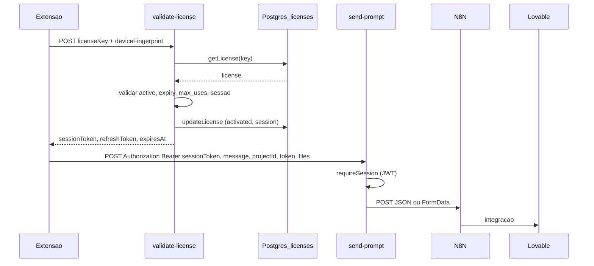
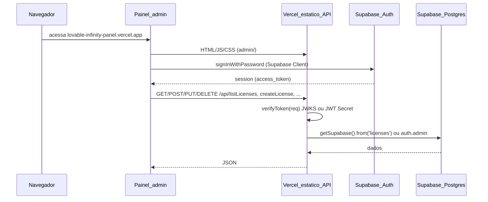

# Arquitetura – Lovable Infinity

Documentação dos fluxos e variáveis de ambiente (Fase 2 da revisão geral).

## Fluxo: Extensão → Supabase → N8N → Lovable

## Fluxo: Painel → Vercel → Supabase

## Variáveis de ambiente

### Vercel (Production)

| Variável | Uso |
|----------|-----|
| **SUPABASE_URL** | api/_lib/supabaseClient.js, verifyToken (verifyViaAuthServer), verifyJwks (JWKS URL). Ex.: https://svjglgrxqxqtonoobcdi.supabase.co |
| **SUPABASE_SERVICE_ROLE_KEY** | supabaseClient (createClient), verifyViaAuthServer (apikey). Obrigatório para API de licenças e panel users. |
| **JWT_SECRET** ou **SUPABASE_JWT_SECRET** | api/_lib/verifyJwtSecret.js (fallback HS256). Opcional se JWKS estiver ok; recomendado para evitar chamada ao Auth em toda request. |

### Supabase Edge Functions (Secrets)

| Secret | Função | Uso |
|--------|--------|-----|
| **SUPABASE_URL** | (injetado) | getSupabaseClient |
| **SUPABASE_SERVICE_ROLE_KEY** | (injetado) | getSupabaseClient |
| **JWT_SECRET** | _shared/jwt.ts | Assinar e validar JWT de sessão (validate-license, verify-session, refresh-session, send-prompt). |
| **N8N_WEBHOOK_URL** | send-prompt, send-message | URL do webhook N8N. Obrigatório para envio de mensagens. |

Outros (se usados por send-message ou enhance-prompt): OPENROUTER_API_KEY, HMAC_SIGNING_SECRET, etc., conforme código de cada função.

## Onde aparecem “clientes e sócios”

No repositório atual:

- **Licenças** = tabela `licenses` (key, user_name, user_phone, owner_id, …). Exibidas na aba Licenças do painel.
- **Usuários do painel** = Supabase Auth (auth.admin.listUsers, createUser, updateUserById, deleteUser). Exibidos na aba Administração (apenas master).

Não há tabelas `clientes` ou `socios` nas migrations. Se existirem no projeto Supabase fora do repo, devem ser documentadas e incluídas no painel (nova aba ou seção) conforme decisão do produto.
