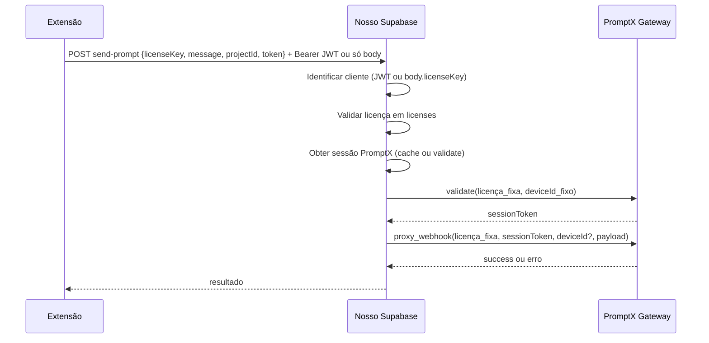

# Plano: Fazer a estratégia do Proxy Funil funcionar (sessão válida)

## Diagnóstico: de onde vem o erro

O texto "Token de sessão inválida" pode ter duas origens:

| Origem | Onde | Quando |
|--------|------|--------|
| **Nosso backend** | [supabase/functions/send-prompt/index.ts](supabase/functions/send-prompt/index.ts) (linha ~394) | Quando `clientLicenseKey` fica vazio: JWT sem claim `licenseKey`/`license_key`/`sub` e sem `licenseKey` no body. Mensagem exata: "Token de sessão inválido.****" (com ponto). |
| **PromptX (repassado)** | Resposta do gateway repassada ao cliente | Quando o gateway retorna `error` ou `message` (ex.: "Token de sessão inválida"). O send-prompt faz `userMessage = result.error \|\| result.message` e devolve ao cliente. |

Para tratar corretamente, é necessário distinguir os dois casos (mensagens diferentes ou código de status + log) e garantir que o fluxo do cliente (nosso JWT + licença) e o fluxo com o PromptX (deviceId fixo + sessão) estejam alinhados ao PRD.

---

## Arquitetura resumida (PRD)

Ponto crítico do PRD: o PromptX associa a licença a **um** deviceId (o da máquina que ativou). Todas as chamadas ao gateway devem usar sempre o **mesmo** deviceId fixo (`PROMPTX_DEVICE_ID`), tanto em `validate` quanto em `proxy_webhook`, para parecer “um único usuário”.

---

## Bloco 1: Identidade do cliente (nosso backend)

Objetivo: nunca devolver "Token de sessão inválido" por falha de identificação quando o cliente enviar licença válida.

- **1.1** Garantir que **sempre** que a extensão envia mensagem, o body contenha `licenseKey` (já feito no [extension/background.js](extension/background.js): `if (stored.licenseKey) payload.licenseKey = stored.licenseKey`). Confirmar que o storage tem `licenseKey` após o login (auth salva em [extension/auth.js](extension/auth.js)).
- **1.2** No [send-prompt/index.ts](supabase/functions/send-prompt/index.ts), manter o fallback que aceita `body.licenseKey` quando o JWT está ausente ou não contém license (já implementado). Garantir que, quando o erro for **nosso** (clientLicenseKey vazio), a mensagem seja distinta da mensagem que pode vir do PromptX (ex.: "Não foi possível identificar sua licença. Faça login novamente ou envie a chave no corpo da requisição.") para facilitar diagnóstico.
- **1.3** Edge Function **validate-license** ([supabase/functions/validate-license/index.ts](supabase/functions/validate-license/index.ts)): já emite JWT com `licenseKey` no payload. Garantir deploy e que o secret **JWT_SECRET** (ou **SUPABASE_JWT_SECRET**) está configurado no Supabase e é o **mesmo** usado pelo send-prompt para verificar o JWT. Sem isso, o JWT é rejeitado e o send-prompt depende só do body.licenseKey.
- **1.4** Popup atualmente exige `sessionToken` para entrar ([extension/popup.js](extension/popup.js) linha 10: `!authData.sessionToken` redireciona para auth). Se validate-license não estiver deployado ou falhar, o usuário nunca recebe sessionToken e pode ficar em loop (auth → popup → auth). **Ajuste:** permitir acesso ao popup quando houver `licenseKey` + `isAuthenticated`, mesmo sem `sessionToken`; ao enviar mensagem, o background já envia `licenseKey` no body, e o send-prompt aceita por fallback. Assim o fluxo funciona mesmo sem JWT.

Resumo Bloco 1: deploy validate-license + JWT_SECRET; popup permitir entrada só com licenseKey; mensagem de erro nossa distinta; body sempre com licenseKey.

---

## Bloco 2: PromptX — deviceId fixo e formato das chamadas

Objetivo: o PromptX “sempre tenta validar com IDs que vêm da minha máquina” — ou seja, a licença PromptX está vinculada a um deviceId (o da sua máquina). O proxy deve usar **sempre** esse mesmo deviceId.

- **2.1** **PROMPTX_DEVICE_ID** nos secrets do Supabase deve ser exatamente o **deviceId/hardware ID da máquina** em que a licença PromptX foi ativada/validada (ex.: valor no estilo `HWID_INTEL(R)CORE(TM)I5-10500H...` do PRD). Se estiver vazio ou errado, o validate pode falhar ou devolver uma sessão que o gateway depois rejeita (ex.: “token de sessão inválida”). Documentar no projeto que esse valor deve ser copiado do ambiente onde a licença PromptX funciona (não gerar aleatório).
- **2.2** No PRD, a tarefa “Montar payload” diz: **Injetar licença fixa + deviceId fixo + sessionToken**. Hoje em [send-prompt/index.ts](supabase/functions/send-prompt/index.ts) o **proxy_webhook** envia apenas `licenseKey` e `sessionToken` no body; **não** envia `deviceId`. Se o gateway do PromptX valida o dispositivo em toda requisição, a falta de `deviceId` em proxy_webhook pode causar rejeição (ex.: “token de sessão inválida”). **Alteração:** incluir `deviceId: PROMPTX_DEVICE_ID` no body da chamada **proxy_webhook** (junto com licenseKey e sessionToken), de forma idêntica ao que é usado em **validate**.
- **2.3** PRD pseudocódigo usa `source: 'RESELLER-EXT'`; o código atual usa `source: "EXTENSION"`. Se o gateway PromptX diferenciar por `source`, alinhar para `RESELLER-EXT` no payload que segue para o PromptX.

Resumo Bloco 2: PROMPTX_DEVICE_ID = device real da máquina dona da licença; enviar deviceId no proxy_webhook; alinhar source com PRD.

---

## Bloco 3: Diagnóstico e tratamento de erros

- **3.1** No send-prompt, ao devolver erro ao cliente, distinguir explicitamente:
  - Erro **nosso** (cliente não identificado, licença nossa inválida): mensagem específica (ex.: "Não foi possível identificar sua licença...") e status 401/403.
  - Erro **do PromptX** (result.error / result.message): repassar como hoje, mas opcionalmente prefixar com algo como "Serviço de envio: " para deixar claro que veio do gateway.
- **3.2** Logs: no send-prompt, registrar se `clientLicenseKey` veio do JWT ou do body; em falha do PromptX, registrar status e corpo da resposta (sem dados sensíveis) para confirmar se o erro "Token de sessão inválida" vem do gateway.
- **3.3** Manter o fluxo atual de 401 do PromptX: renovar sessão (createNewPromptxSession) e tentar proxy_webhook novamente; se ainda falhar, devolver o erro ao cliente com mensagem clara.

---

## Bloco 4: Checklist de configuração e deploy

- **Secrets no Supabase (Edge Functions):**  
  `JWT_SECRET` (ou `SUPABASE_JWT_SECRET`), `PROMPTX_LICENSE_KEY`, `PROMPTX_DEVICE_ID`, `PROMPTX_GATEWAY_URL`, `PROMPTX_ANON_KEY`.
- **Deploy:**  
  `validate-license` e `send-prompt` deployados (ex.: `npx supabase functions deploy validate-license send-prompt --no-verify-jwt --project-ref svjglgrxqxqtonoobcdi`).
- **Banco:**  
  Tabelas `licenses`, `session_cache` e `usage_logs` existem e RLS permite acesso via service_role (já coberto por [setup-proxy-funil.sql](supabase/setup-proxy-funil.sql)).
- **Extensão:**  
  Após login, storage tem `licenseKey`; popup pode abrir com licenseKey mesmo sem sessionToken; ao enviar mensagem, body inclui `licenseKey`.

---

## Ordem sugerida de implementação

1. **PromptX (Bloco 2):** Adicionar `deviceId` no body do proxy_webhook e, se aplicável, `source: 'RESELLER-EXT'`. Confirmar que PROMPTX_DEVICE_ID está correto nos secrets.
2. **Cliente (Bloco 1):** Ajustar popup para permitir entrada com licenseKey sem sessionToken; opcionalmente diferenciar mensagem de erro quando clientLicenseKey estiver vazio.
3. **Deploy e secrets (Bloco 4):** Validar JWT_SECRET e deploy de validate-license.
4. **Diagnóstico (Bloco 3):** Ajustes de mensagens e logs conforme acima.

Com isso, a estratégia do PRD fica consistente: um deviceId fixo (sua máquina) para o PromptX em todas as chamadas, e identificação do cliente no nosso backend por JWT ou por licenseKey no body, com fallback que evita "Token de sessão inválido" quando a licença nossa é válida.
